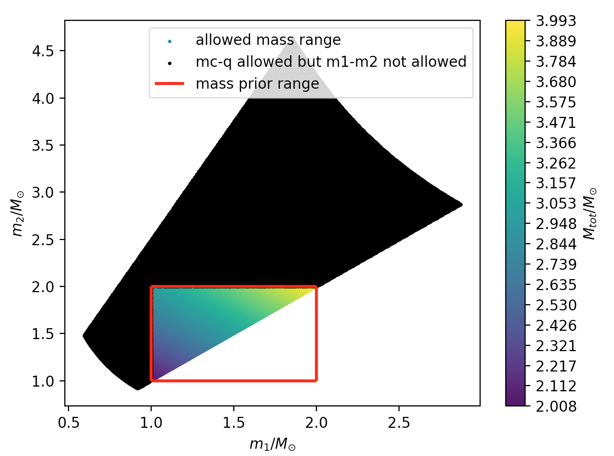

## Examples

- HTML document can be found in [This page](doc/html/index.html)

- Below we adopt these python names:

```python
import numpy as np
import my_cbc_tools as myt

m1 = np.random.normal(loc=6, scale=0.2, size=10000)
m2 = np.random.normal(loc=0.3, scale=0.2, size=10000)
m3 = np.random.normal(loc=3.3, scale=1.2, size=10000)
m4 = np.random.normal(loc=2.3, scale=1.2, size=10000)
m5 = m2*(-2.3)
m6 = m3*m4
m7 = np.random.normal(loc=2.3, scale=1.2, size=10000)

marginal_percentiles = [5, 50, 95]
contour_percentiles = [68.3, 95.5]
```


1. Show posterior samples of two variables and their True values:

```python
myt.plot_density(m1, m2, true_values=[5.9, 0.2], xlabel='m1', ylabel='m2', m_pt=marginal_percentiles, c_pt=contour_percentiles)
```


2. Compare two samples:

```python
myt.compare_two_sample_plots(m1, m3, xlabel=r'$M_{\odot}$', bins=12, percentiles=[5.0, 50.0, 95.0], histtype='bar', name1='ligo result', name2='out result')
```


3. Compare multiple samples:

```python
myt.compare_sample_plots([m1, m2, m3], xlabel=r'$M_{\odot}$', labels=['group_1', 'group_2', 'group_3'])
```


4. Show properties of single posterior sample:

```python
myt.plot_single(m1, true_value=5.9, bins=20, xlabel=r'$M_{\odot}$', percentiles=[20,50,80])
```


5. Compare two pairs of samples:

```python
myt.compare_two_sample_pairs([m4,m3], [m3,m4], xlabel=r'$R/km$', colors=['m','c'], ylabel=r'$M/M_{\odot}$', c_pt=contour_percentiles, m_pt=marginal_percentles)
```


6. Show mass range:

```python
myt.plot_mass_range(m1_range=(1., 2.), mc_range=(0.8, 2.5), q_range=(0.4, 1.))
```




7. Show correlation of parameters & classify parameter groups

```python
myt.plot_corr([m1, m2, m3, m4, m5, m6], names=['m1', 'm2', 'm3', 'm4', 'm5', 'm6'])
```


8. Calculate HPD interval (devided by prior)

```python
dived_xy = myt.hpd_interval(m7, conf_interval=90, prior_sample=m4, return_sample=True, return_size=2000, prior_method='div_bin')
myt.cal_pdf_hpd(dived_xy[0], dived_xy[1])
#Output: (-2.07078247092584, 2.300940959393328, 6.787943100856815)
```

```python
#If we plot the dived_xy, we expect a uniform distribution because the prior(m4) and posterior(m7) come from the same distribution.
plt.scatter(dived_xy[0], dived_xy[1], s=0.2, color='r', label='derived pdf')
minx = min(m7); maxx=max(m7)
plt.plot(np.linspace(minx, maxx, 200), [1./(maxx-minx)]*200, c='g', label='Uniform dist')
plt.legend()
plt.show()
```


9. Calculate stats different between two samples

```python
myt.compare_two_sample_stats(m4, m7)
#Output:
#Jensen-Shannon divergence: 0.000304139953798
#
#--------------------------------------------
#
#    Test method          statistic       p-value
#=====================    =========      ==========
#Two sided KS test      : +1.500E-02	+2.089E-01
#Mann-Whitney rank test : +4.972E+07	+2.450E-01
#Wald-Wolfowitz run test: -8.627E-01	+3.883E-01
```

10. Useful conversions

```python
chirp_mass, lambda_tilde = myt.mclt_from_m12l12(m1, m2, l1, l2)
```

11. Load data

It is straightforward to load GWTC-1 data by one line code.

```python
costheta_jn, luminosity_distance, right_ascension, declination, m1, m2, spin1, spin2, costilt1, costilt2 = myt.load_hdf("./GW150914_GWTC-1.hdf5", data_path="/IMRPhenomPv2_posterior", data_type="ligo")
```

